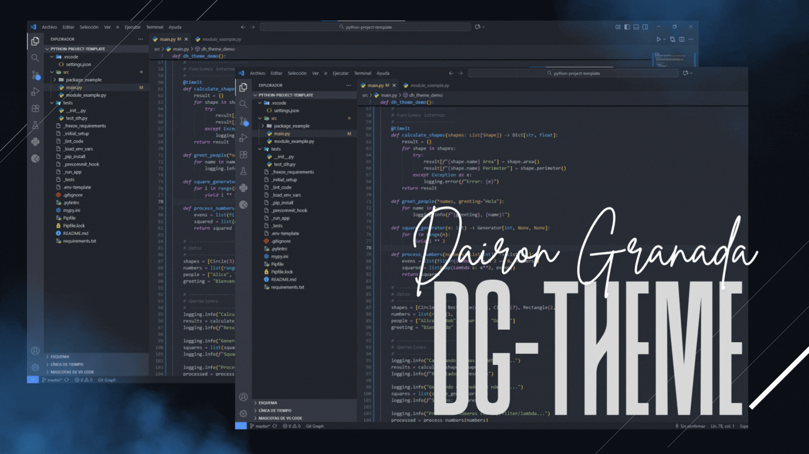

# DG-THEME 🌙 (Super Dark) <code>PRO</code>

---

## Installation

1. Open Visual Studio Code.
2. Go to the **Extensions** tab.
3. Search for `DH-THEME` and click **Install**.
4. Activate it from `Preferences > Color Theme`.

---

## Features

- Modern and professional dark theme
- Compatible with VSCode 1.80+
- Soft colors for working at night
- Clear and elegant syntax and UI element highlighting.

---

## Syntax Colors

| USAGE                         | HEX CODE |
| ----------------------------- | -------- |
| Activity Bar Background        | `#333842` |
| Activity Bar Foreground        | `#D7DAE0` |
| Activity Bar Badge Background  | `#528BFF` |
| Activity Bar Badge Foreground  | `#D7DAE0` |
| Editor Background             | `#282C34` |
| Editor Foreground             | `#ABB2BF` |
| Editor Cursor                 | `#528BFF` |
| Selection Background          | `#3E4451` |
| Line Highlight Background     | `#99BBFF0A` |
| Inlay Hint Background         | `#2C313A` |
| Inlay Hint Foreground         | `#636E83` |
| Button Background             | `#4D78CC` |
| Button Foreground             | `#FFFFFF` |
| Button Hover Background       | `#6087CF` |
| Status Bar Background         | `#21252B` |
| Status Bar Foreground         | `#9DA5B4` |
| Tab Active Background         | `#282C34` |
| Tab Active Foreground         | `#D7DAE0` |
| Sidebar Background            | `#21252B` |
| Extension Button Prominent     | `#2BA143` |
| Extension Button Hover         | `#37AF4E` |
| Badge Background              | `#528BFF` |
| Badge Foreground              | `#D7DAE0` |
| Peek View Background          | `#21252B` |
| Peek View Selection Background| `#2C313A` |

>---------
> These colors accurately reflect the DH-THEME theme so users see exactly how it looks in VSCode.
>---------

Copyright &copy; 2025-present <a href="https://www.instagram.com/dairongranadaa" target="_blank">Dairon Granada.</a>

